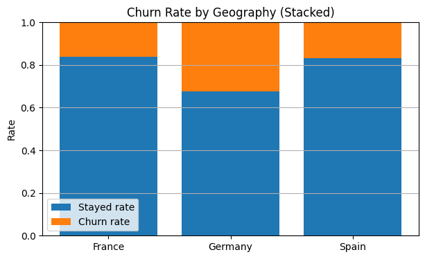
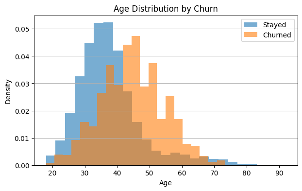
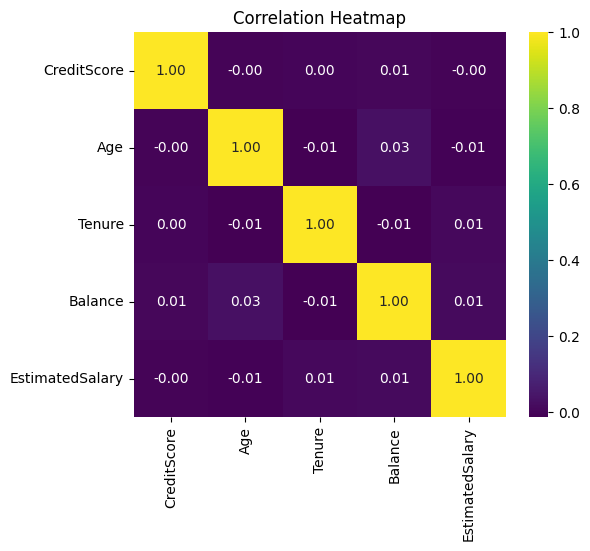
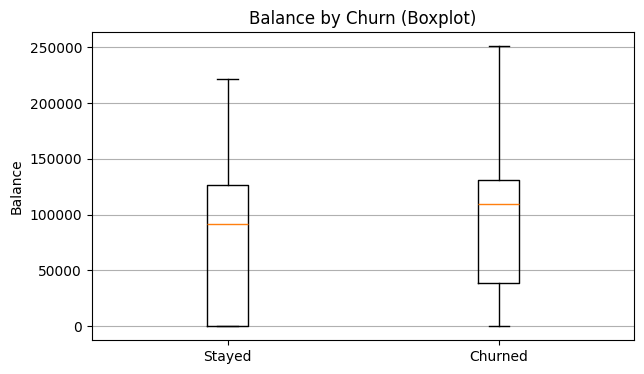
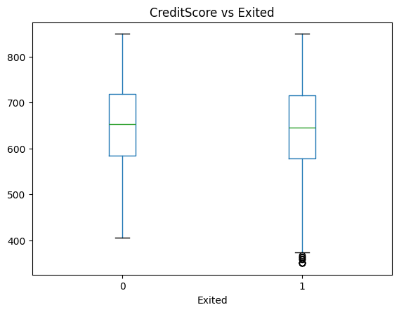
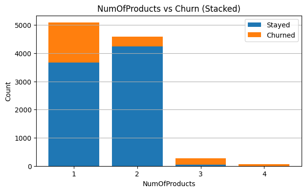

# Customer Churn Prediction for a Bank

##  Project Overview
This project predicts **customer churn** in a retail bank dataset using machine learning.  
The notebook demonstrates a full end-to-end workflow:  
- Exploratory Data Analysis (EDA)  
- Feature preprocessing with a **scikit-learn Pipeline**  
- Model training with **XGBoost**  
- **Threshold optimization** (Precision–Recall, F1-based)  
- Model evaluation with **ROC-AUC, confusion matrix, classification report**  
- Interpretability with **SHAP values (plots + table)**  
- Model saving & reusability with **joblib**  

---

##  Key Results
### Model Performance Comparison
| Model          | ROC-AUC | Accuracy | F1-Score |
|----------------|---------|----------|-----------|
| XGBoost        | 0.8721  | 0.8635  | 0.6147    |
| Random Forest  | 0.8534  | 0.8560  | 0.5893    |

### Threshold Analysis
- **Default (0.5)**: Balanced precision/recall
- **Optimized (0.4)**: Higher recall for identifying at-risk customers
- **Conservative (0.6)**: Higher precision, fewer false alarms

### Top Churn Drivers (by SHAP importance)
1. Age
2. Balance
3. NumOfProducts
4. Geography_Germany
5. IsActiveMember

---

##  Repository Structure
- `Predicting_Churn_for_Bank_Customers.ipynb` → Main notebook (EDA + Modeling + SHAP)  
- `churn_model.pkl` → Saved pipeline model (ready for inference)  
- `Churn_Modelling.csv` → Dataset (if license allows to upload, otherwise provide dataset link)  

---

##  Visual Highlights

### Churn Analysis by Geography
  
*Churn rates vary significantly across different countries, with Germany showing the highest churn rate.*

### Age Distribution Analysis
  
*Age distribution comparison between churned and non-churned customers shows higher churn tendency in older customers.*

### Feature Correlation Analysis
  
*Correlation heatmap showing relationships between numerical features.*

### Additional Insights

### Balance Distribution by Churn Status
  
*Distribution of account balances for churned vs non-churned customers.*

### Credit Score Analysis
  
*Credit score patterns between churned and retained customers.*

### Product Usage Patterns
  
*Analysis of how product usage correlates with customer churn.*

---

##  Key Insights & Business Implications
1. **Age Impact**: Age is the strongest predictor of churn, with older customers showing higher churn tendency
2. **Balance Relationship**: Higher balances correlate with increased churn risk
3. **Product Diversity**: Customers with fewer products are more likely to leave
4. **Geographic Variation**: German customers show significantly higher churn rates
5. **Engagement Matters**: Active membership status strongly affects retention

## Implementation Details
- **Preprocessing Pipeline**: 
  - One-hot encoding for categorical variables
  - Standard scaling for numerical features
- **Model Selection**: XGBoost with hyperparameter optimization
- **Evaluation Metrics**: ROC-AUC, Precision-Recall, F1-Score
- **Interpretability**: SHAP analysis for feature importance

## Recent Updates
- Enhanced hyperparameter optimization
- Improved visualization functions
- Code refactoring for maintainability
- Additional threshold optimization analysis
- Complete English language support

## Next Steps
- Deploy model via **Flask/FastAPI** for real-time predictions
- Implement A/B testing for retention strategies
- Develop automated retraining pipeline
- Create interactive dashboard for business users

---

##  Tech Stack
- Python, Pandas, NumPy  
- Scikit-learn, XGBoost  
- SHAP, Matplotlib, Seaborn  

---
##  Author
Developed by **Samet Can Özden**  
Email: xcanozden@gmail.com  
